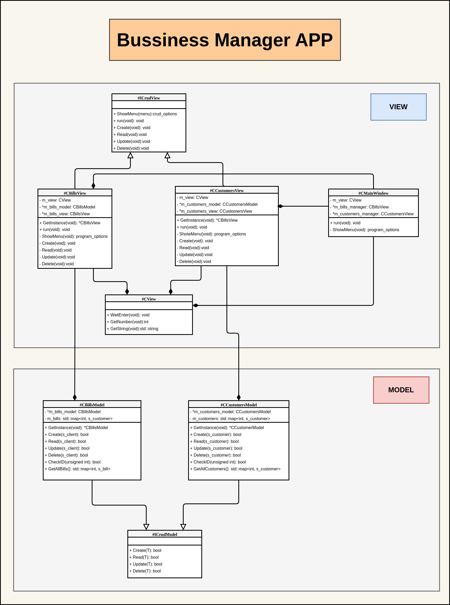

# Business Manager

## Versions Used

- Conan version:

    ```bash
    Conan version 2.0.4
    ```

- Cmake version:

    ```
    cmake version 3.26.3
    ```

- Minimum C++17.


## Architecture

The latest updated architecture is found in: __"architecture.drawio"__ file.

<div style="text-align:center;">
    </img>
</div>

## How to manage the project

The set up, compilation, clean and run of the project is manage by __"project_manager.sh"__ program.

Running the following command, it will show by default the help of the program.

```bash
./ProjectManager.sh
```

The help of the program shows this:

```
Usage
        ./ProjectManager.sh [options]
Options
   help, h           = Run the project.
   all               = Configure, build and run the project. This argument is launch by default if no arguments is passed.
   configure         = Configure the project.
   clean             = Clean the project.
   build             = Build the project.
   run               = Run the project.
   rm                = Remove all the files created
   test              = Configure, build and run the unit tests of the project.
```

